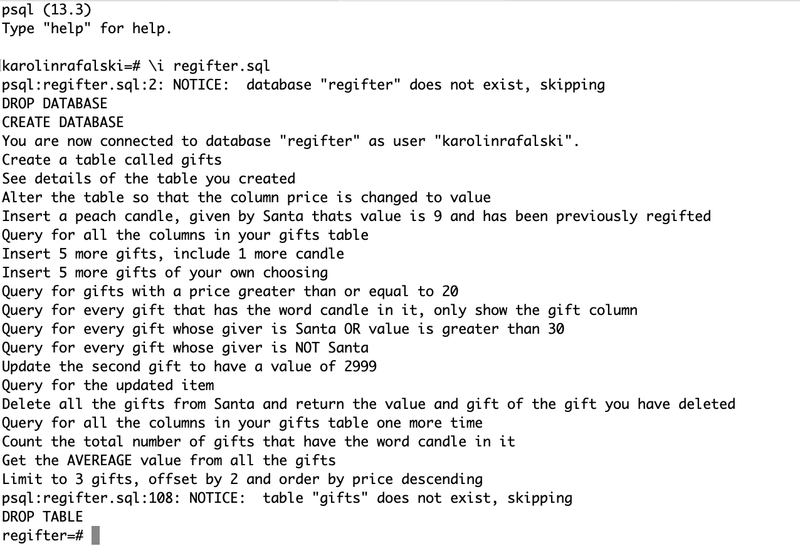
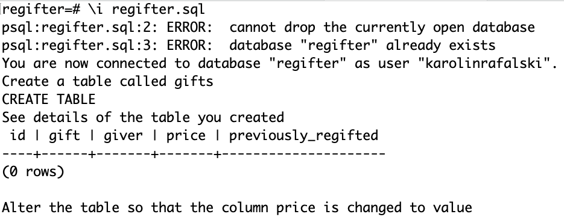

# SQL Regifter

# Regftr


An unfortunate occurrence is happening with increasing frequency. Friendships and trust are being torn asunder. The social fabric of many co-workers, friends and even families is fraying and tumbling into chaos. Too many times, gifts are regifted to the original gift-giver!

You think to yourself, there has to be a way to help! To make things better... with a database!

## Getting Started

**terminal**

- fork and clone this repository
- `cd` into to directory
- `ls` make sure you see the file `regifter.sql`
- `psql`
- `\i regifter.sql` to run the file `regifter.sql`

**SUCCESS**



## Activity

Open the `regifter.sql` file with your text editor

There is a prompt for each SQL command you should write. `\echo` will print the instructions ot he console.

```sql
--
\echo Query for all the columns in your gifts table
--

```

You will write your code right below each prompt

```sql
--
\echo Query for all the columns in your gifts table
--
SELECT * FROM gifts;
--
```

**Output:**



Remember to press `\q` to quit out of `psql`
